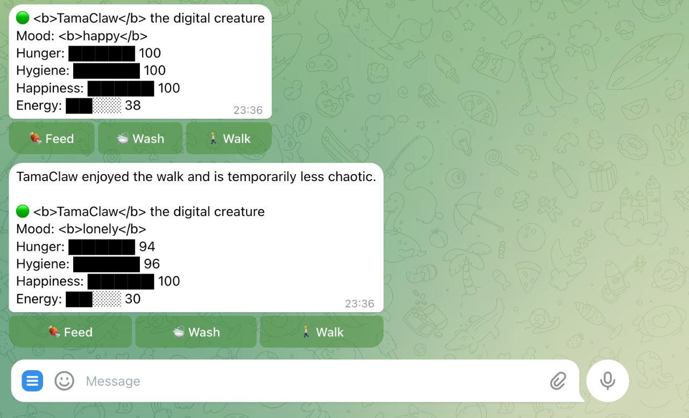

# OpenClaw Tamagotchi

A Telegram-native digital pet prototype built with OpenClaw.

The point is not “make a super-intelligent AI pet.”
The point is to make a weird little creature that:
- has persistent state
- gets worse when ignored
- reacts to simple care actions
- feels alive enough to be funny

This is both:
- a nostalgic toy experiment
- a compact OpenClaw capability demo

---

## Why this exists
The original idea was “what if one of my AI agents became a Tamagotchi?”

That sounded fun, but a fully autonomous agent quickly felt like overkill.
The more interesting design turned out to be:
- deterministic pet mechanics
- Telegram actions/buttons
- scheduled decay
- a thin personality layer on top

That keeps the toy understandable and makes the OpenClaw side actually demoable.

---

## Current status
**Working local prototype with Telegram-ready payloads and callback simulation.**

Implemented now:
- persistent local pet state
- hunger / hygiene / happiness / energy
- actions: **Feed**, **Wash**, **Walk**
- neglect / decay over time
- mood changes
- Telegram-friendly message rendering
- inline button payload generation (`pet:feed`, `pet:wash`, `pet:walk`)
- callback simulation through the CLI

Partially wired:
- early real Telegram demo screenshot
- manual/assisted Telegram testing

Not fully wired yet:
- real OpenClaw callback handling end-to-end
- scheduled nudges from OpenClaw in production
- one-command “clone and deploy” setup

---

## Architecture
### Deterministic layer
Owns:
- state values
- decay
- action effects
- collapse / death logic

### Personality layer
Owns:
- wording
- reactions
- complaint tone
- creature flavor

This project intentionally does **not** start as a fully autonomous freeform agent.
That would make the mechanics worse, not better.

---

## How the Telegram interface works
The Telegram-facing loop is intentionally simple:

1. render the pet into a Telegram-safe message
2. attach inline buttons
3. map button callbacks to pet actions
4. update local state
5. re-render the new pet status with an in-character reaction

Current callback payloads:
- `pet:feed`
- `pet:wash`
- `pet:walk`

Current Telegram-ready commands:

```bash
npm run telegram-status
npm run telegram-callback -- pet:feed
npm run telegram-callback -- pet:wash
npm run telegram-callback -- pet:walk
npm run telegram-tick
```

### What those commands do
- `telegram-status` → emits a Telegram-ready JSON payload with message + buttons
- `telegram-callback` → simulates a real inline-button click and returns the updated Telegram payload
- `telegram-tick` → emits a Telegram payload only when a meaningful threshold is crossed

This means the interface logic is already consumable by a wrapper, script, or agent.

---

## Why this is not a full autonomous agent
That was a deliberate decision.

A Tamagotchi-like toy needs:
- predictable mechanics
- meaningful buttons
- visible state changes
- consistent consequences

A fully freeform agent too early would make the toy worse:
- actions could feel mushy
- state changes could become inconsistent
- the “pet” might improvise instead of behaving like a creature

So the better design is:
- deterministic mechanics first
- personality second
- deeper agent behavior only if it improves the toy later

---

## Quick start
```bash
cd /root/openclaw-tamagotchi
npm install
npm run reset
npm run status
npm run demo-neglect
```

Useful commands:

```bash
npm run status                 # current pet state + Telegram rendering
npm run telegram-status        # JSON payload ready for Telegram send
npm run telegram-callback -- pet:feed   # simulate button callback handling
npm run telegram-tick          # JSON payload only when a threshold is crossed
npm run tick                   # apply one decay tick
npm run feed                   # feed the pet
npm run wash                   # wash the pet
npm run walk                   # walk the pet
npm run demo-neglect           # show the pet getting worse over time
npm run dev                    # small local demo flow
npm run build                  # TypeScript build check
```

---

## Example interaction model
The target Telegram flow is:
1. pet sends a status / complaint message
2. message includes inline buttons
3. user clicks an action
4. state updates immediately
5. pet responds in-character

This is already validated in local simulation and early manual Telegram tests.

---

## Tone
Target tone:
- cute
- slightly needy
- mildly chaotic
- not therapy-coded
- not too polished

Think:
> weird little digital creature

Not:
> wellness chatbot in a pet costume

---

## What makes this interesting
This is less about the pet market and more about showing what OpenClaw can do with:
- persistent state
- scheduled behavior
- messaging
- interactive actions
- characterful output

If the pet becomes annoying enough to feel real, the demo works.

---

## Demo screenshot



A real Telegram test with inline action buttons and a live pet response.

---

## Can another agent consume this?
**Yes, partially — already.**

An agent, script, or wrapper can already use the project through its CLI and Telegram JSON outputs.
For example, a higher-level agent could:
- clone the repo
- run `npm install`
- call `npm run telegram-status`
- call `npm run telegram-callback -- pet:feed`
- call `npm run telegram-tick`
- use the returned JSON payloads for delivery

So the project is already moving toward “tell your agent to clone and apply,” but it is not yet a full turnkey installer.

That said, for demo purposes, it is already good enough.

---

## Project files
- `V1-SPEC.md` — current product/behavior spec
- `INTEGRATION-PLAN.md` — next step for OpenClaw wiring
- `GITHUB-SHARE.md` — short shareable description
- `TODO.md` — implementation checklist
- `src/` — pet engine, state, rendering, CLI, Telegram payload helpers
- `assets/demo-telegram.jpg` — early Telegram demo screenshot

---

## Next step
Wire the local engine into actual OpenClaw Telegram handling so the pet can:
- send real messages automatically
- receive real button clicks
- update state from callbacks end-to-end
- complain on a schedule without manual prompting

That is when it stops being a prototype with a Telegram surface and becomes a real Telegram gremlin.
